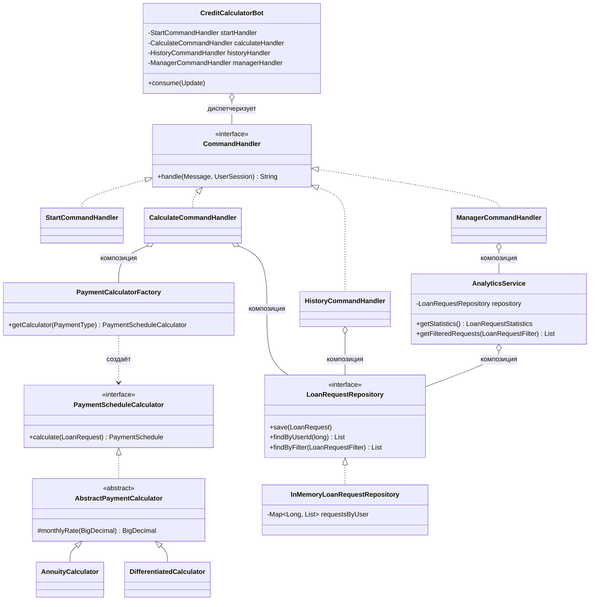

<div align="center">

# 🏦 Credit Calculator Bot

**Telegram-бот для расчёта графиков погашения кредитов**
*(аннуитетные и дифференцированные платежи)*

[](https://openjdk.org/)
[](https://maven.apache.org/)
[](https://github.com/rubenlagus/TelegramBots)
[]()
[]()

🤖 **Бот в Telegram:** [@Bank_credit_calc_bot](https://t.me/Bank_credit_calc_bot)

</div>

---

Telegram-бот для расчёта графиков погашения кредитов (аннуитетные и дифференцированные
платежи), написанный на чистой Java (без Spring, без Hibernate) с использованием
Telegram Bots API и Java Collections Framework.

## 📋 Содержание

- [Возможности](#-возможности)
- [Технический стек](#%EF%B8%8F-технический-стек)
- [Структура проекта](#-структура-проекта)
- [Диаграмма классов](#-диаграмма-классов)
- [Архитектура и применение принципов](#-архитектура-и-применение-принципов)
- [Безопасность токена](#-безопасность-токена)
- [Запуск проекта](#-запуск-проекта)
- [Пример использования](#-пример-использования)

---

## ✨ Возможности

### 👤 Для пользователей

| Команда | Описание |
|---|---|
| `/start` | приветствие и список команд |
| `/calculate` | пошаговый расчёт графика платежей по кредиту |
| `/history` | история собственных запросов |

### 🔐 Для менеджеров

| Команда | Описание |
|---|---|
| `/manager` | авторизация по логину и паролю |
| `/stats` | агрегированная статистика по всем запросам (средняя сумма, средний срок, распределение и популярность видов платежа) |
| `/filter <мин_сумма> <макс_сумма> [вид]` | фильтрация запросов по диапазону суммы и опционально по виду платежа (`1` — аннуитетный, `2` — дифференцированный) |

---

## 🛠️ Технический стек

- ☕ **Java 21**
- 📡 [TelegramBots](https://github.com/rubenlagus/TelegramBots) (`telegrambots-longpolling`, `telegrambots-client`) — версия 10.0.0
- 📦 **Maven**
- 🗂️ **Java Collections Framework** (`ArrayList`, `HashMap`) для хранения данных — без базы данных
- 💰 **`BigDecimal`** для всех денежных расчётов (без погрешностей `double`)

---

## 📁 Структура проекта

```
src/main/java/com/danielyaruta/creditbot/
├── Main.java                  — точка входа, сборка зависимостей (composition root)
├── domain/                    — модель данных (неизменяемые record-классы)
│   ├── LoanRequest.java
│   ├── PaymentType.java
│   ├── PaymentEntry.java
│   └── PaymentSchedule.java
├── calculator/                — расчёт графика платежей
│   ├── PaymentScheduleCalculator.java   (интерфейс — абстракция)
│   ├── AbstractPaymentCalculator.java   (общая база)
│   ├── AnnuityCalculator.java
│   ├── DifferentiatedCalculator.java
│   └── PaymentCalculatorFactory.java    (Factory pattern)
├── storage/                    — хранилище запросов
│   ├── LoanRequestRepository.java       (интерфейс — абстракция)
│   ├── InMemoryLoanRequestRepository.java
│   └── LoanRequestFilter.java
├── analytics/                  — аналитика для менеджеров
│   ├── AnalyticsService.java
│   └── LoanRequestStatistics.java
├── formatter/                  — форматирование вывода
│   └── PaymentScheduleFormatter.java
├── config/                     — конфигурация без секретов в коде
│   └── BotConfig.java
└── bot/                        — диалог и маршрутизация Telegram-команд
    ├── CreditCalculatorBot.java         (точка входа обновлений, диспетчер)
    ├── CommandHandler.java              (интерфейс — абстракция команды)
    ├── StartCommandHandler.java
    ├── CalculateCommandHandler.java
    ├── HistoryCommandHandler.java
    ├── ManagerCommandHandler.java
    ├── DialogState.java
    ├── UserSession.java
    └── UserSessionManager.java
```

---

## 🧩 Диаграмма классов



> **Как читать диаграмму:**
> - `<|..` — реализация интерфейса (абстракция)
> - `<|--` — наследование (только для общей логики расчёта месячной ставки в калькуляторах)
> - `o--` — композиция: класс содержит ссылку на другой через конструктор, но не наследует его

---

## 🏗️ Архитектура и применение принципов

### 🔹 Абстракция

Каждый изменяемый по реализации компонент системы скрыт за интерфейсом:

- **`PaymentScheduleCalculator`** — вызывающий код (диалог бота) не знает, считается ли
  график по аннуитетной или дифференцированной формуле. Он просит у
  `PaymentCalculatorFactory` подходящий калькулятор и вызывает единственный метод
  `calculate(LoanRequest)`.
- **`LoanRequestRepository`** — обработчики команд и сервис аналитики работают только
  с этим контрактом. Текущая реализация (`InMemoryLoanRequestRepository`) хранит данные
  в `HashMap`/`ArrayList`, но её можно заменить на JDBC-реализацию без единой правки
  в остальном коде.
- **`CommandHandler`** — каждая команда бота (`/start`, `/calculate`, `/history`,
  `/manager`) реализует один и тот же простой контракт.

### 🔹 Композиция

Классы строятся через «имеет», а не «является»:

- `AnalyticsService` **содержит** ссылку на `LoanRequestRepository`, переданную через
  конструктор (Dependency Injection), а не наследует его.
- `CalculateCommandHandler` **содержит** фабрику калькуляторов, репозиторий и форматтер —
  использует их для своей работы, оставаясь самостоятельным классом с одной задачей
  (провести диалог).
- `CreditCalculatorBot` **содержит** все обработчики команд и просто маршрутизирует
  им входящие сообщения.

Наследование используется только один раз и обоснованно: `AnnuityCalculator` и
`DifferentiatedCalculator` наследуют `AbstractPaymentCalculator`, чтобы не дублировать
перевод годовой ставки в месячную — это переиспользование вспомогательной логики,
а не построение иерархии типов (основной контракт всё равно — интерфейс).

### 🔹 Low Coupling (низкая связанность)

- Пакеты `domain`, `calculator`, `storage`, `analytics` не содержат ни одного импорта
  из Telegram Bots API. Это позволило протестировать всю бизнес-логику (расчёты,
  хранение, статистику) полностью изолированно от бота, без единого живого `Update`.
- `bot`-пакет не знает деталей вычислений — он лишь вызывает абстракции
  (`PaymentScheduleCalculator`, `LoanRequestRepository`) и форматирует ответ.
- Чтобы добавить новую команду, не нужно менять `CreditCalculatorBot` в части
  существующих обработчиков — достаточно создать новый `CommandHandler` и одну строку
  маршрутизации.

### 🔹 High Cohesion (высокая связность)

Каждый класс отвечает за одну задачу:

| Класс | Единственная ответственность |
|---|---|
| `AnnuityCalculator` | считает один вид платежа |
| `InMemoryLoanRequestRepository` | хранит и возвращает запросы |
| `AnalyticsService` | считает статистику по уже сохранённым данным |
| `PaymentScheduleFormatter` | превращает график в текст для Telegram |
| `UserSessionManager` | хранит, на каком шаге диалога находится каждый пользователь |
| `CreditCalculatorBot` | маршрутизирует сообщения нужному обработчику |

### 🔹 Factory Pattern

`PaymentCalculatorFactory` скрывает выбор конкретной реализации калькулятора за одним
методом `getCalculator(PaymentType)`. При добавлении нового вида платежа достаточно
зарегистрировать новую реализацию в карте фабрики — остальной код не меняется
(Open/Closed Principle).

### 🔹 SOLID, DRY, KISS, YAGNI

| Принцип | Применение |
|---|---|
| **SRP** | см. таблицу High Cohesion выше |
| **OCP** | новые виды платежей и новые команды добавляются без изменения существующих классов |
| **DIP** | высокоуровневые компоненты (`CalculateCommandHandler`, `AnalyticsService`) зависят от абстракций (`PaymentScheduleCalculator`, `LoanRequestRepository`), а не от конкретных реализаций |
| **DRY** | общая логика расчёта месячной ставки вынесена в `AbstractPaymentCalculator` |
| **KISS** | хранилище защищено простой синхронизацией на уровне методов вместо сложных конкурентных структур; авторизация менеджера хранится прямо в сессии без отдельной системы токенов — для объёма задачи этого достаточно |
| **YAGNI** | БД и файловое хранение не реализованы, так как задание явно допускает in-memory хранилище через коллекции; их легко добавить позже благодаря интерфейсу `LoanRequestRepository` |

---

## 🔒 Безопасность токена

Токен бота и учётные данные менеджера **не хранятся в коде и не попадают в репозиторий**.
`BotConfig` ищет их в следующем порядке:

1. Переменные окружения `BOT_TOKEN`, `MANAGER_LOGIN`, `MANAGER_PASSWORD`
2. Файл `config.properties` в корне проекта (добавлен в `.gitignore`)

Шаблон для локальной настройки — `config.properties.example`.

---

## 🚀 Запуск проекта

1. Зарегистрируйте бота через [@BotFather](https://t.me/BotFather) и получите токен.
2. Скопируйте `config.properties.example` в `config.properties` и заполните:
   ```properties
   bot.token=ВАШ_ТОКЕН_ОТ_BOTFATHER
   manager.login=admin
   manager.password=ваш_пароль
   ```
3. Откройте проект в IntelliJ IDEA как Maven-проект (Maven подтянет зависимости
   автоматически).
4. Запустите `com.danielyaruta.creditbot.Main`.
5. В консоли должно появиться: `✅ Бот успешно запущен и готов принимать сообщения!`
6. Откройте бота в Telegram и отправьте `/start`.

<details>
<summary><b>⚙️ Альтернативный запуск через переменные окружения</b></summary>

```bash
export BOT_TOKEN="ваш_токен"
export MANAGER_LOGIN="admin"
export MANAGER_PASSWORD="пароль"
mvn clean package
java -jar target/credit-bot.jar
```

</details>

---

## 💬 Пример использования

**👤 Пользователь:**
```
/calculate
> Введите сумму кредита: 100000
> Введите срок в месяцах: 12
> Введите ставку: 12
> Вид платежа: 1 (аннуитетный)
```
Бот возвращает полный график платежей по месяцам и итоговую переплату.

**🔐 Менеджер:**
```
/manager
> Логин: admin
> Пароль: ********
/stats
```
Бот возвращает агрегированную статистику по всем запросам пользователей.

---
